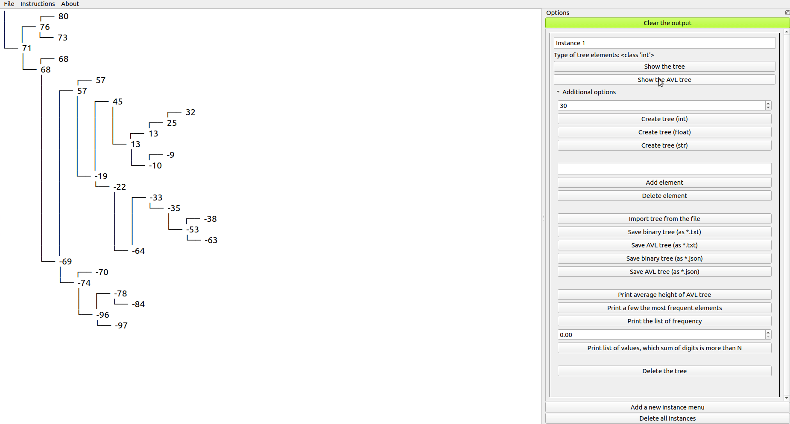
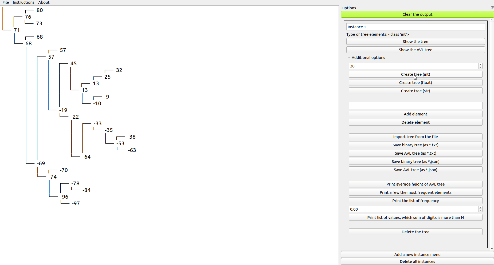
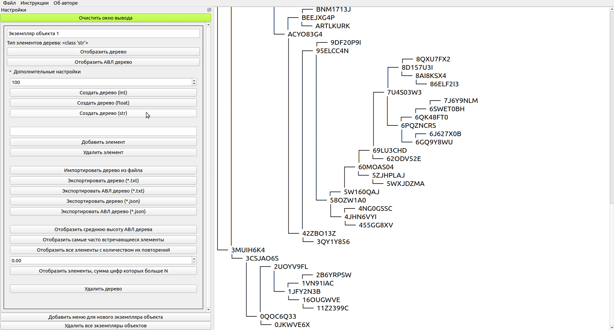
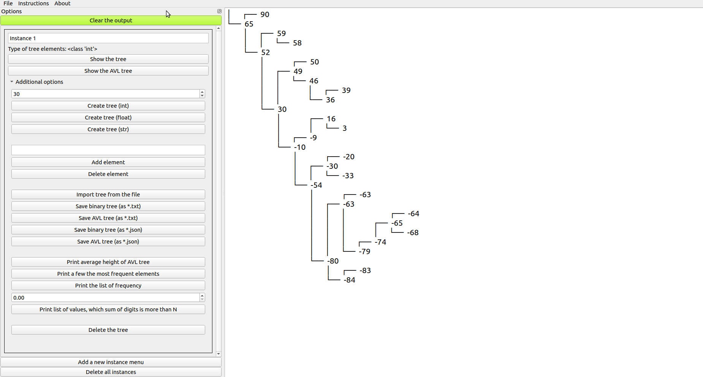
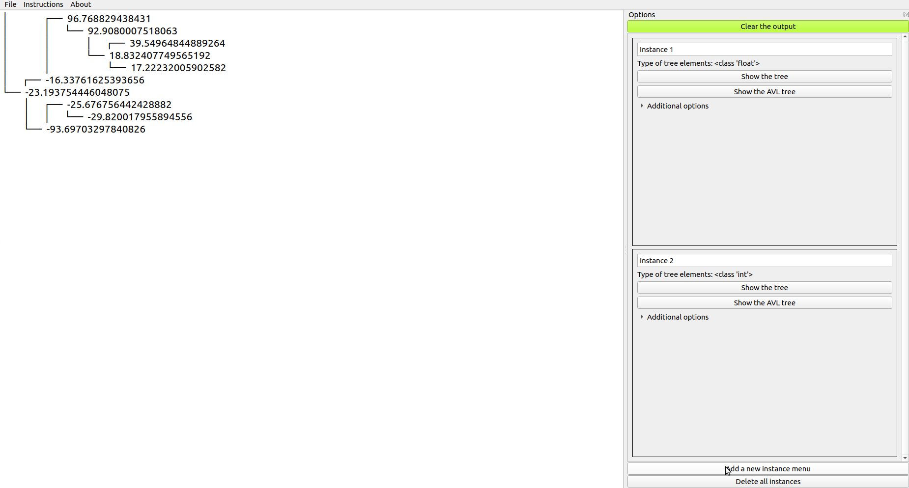

# Simple-Binary-Tree-Realization

This is a project to develop, implement and display custom data structures, including binary trees and height-balanced binary trees, also called AVL trees (named after inventors Adelson-Velsky and Landis). This is one of my projects from one of my university courses.

An original technical task is attached and displayed down below.

# Results

All tasks are fully completed within the deadline (Dec of 2019). I'm sorry that I didn't add this README file earlier.



A demo of int/float/str trees:




# What are the parts of this repo?

### Back-end

There are 3 separate files:

1. 'main.py', contains a gui with all needed classes
2. 'main_without_gui.py', contains classes for a basic binary tree implementation
3. 'main_avl.py', contains avl tree implementation

### Cross-platform interface

An interface is written both in Russian and in English, so it is possible to switch language dictionaries in the source code



It is possible to change the look of the interface



This app has a tree-viewer based on PyQt5. This viewer is able to:

- to show the same data as a binary tree and as a height-balanced tree

- to add/delete elements

- to import/export trees as json files

- to export trees as 'txt' files, to export trees as 'png' files

- to add as many trees as You want




# Technical Task (The original version is written in Russian)

Design a class to represent a data structure in
the form of ***a binary tree***. Develop a separate class for ***a height-balanced binary tree***.
Classes have to contain an implementation of methods to add/remove an item, to display the elements.

Demonstrate the work by using int/float/str types.

Design a manual input for the elements. Develop a random tree generator, including n = 10, 50, 100, 200, 400, where n is a number of nodes in the tree.
Be able to compute the average height of each tree. The numbers must be in the range from -99 to 99.

Find (insert or remove if necessary) items
in accordance with the following options for tasks, the 9th variant:
* Find the maximum element of a binary tree and the number of repetitions of the maximum element in the given tree.
* Display the numbers, the sum of digits (modulo) of which is > N, where N is a number that the user can set. Determine the level of these elements. 

***Design a graphical user interface.***


# Техническое задание
Разработать класс для представления структуры данных в
виде ***бинарного дерева***. Разработать отдельный класс для ***сбалансированного по высоте бинарного дерева***.
Реализуемые классы в качестве обязательных методов
должны иметь функции удаления/добавления элемента, вывод текущих элементов.

Продемонстрировать работу классов, используя типы int/float/str.

Предусмотреть ручной ввод элементов. Используя генератор случайных чисел, сформировать бинарное дерево, состоящее из n = 10, 50, 100, 200,
400 (n – количество вершин в дереве). Вычислить среднюю высоту АВЛ-дерева
для каждого случая. Причем числа должны лежать в диапазоне от -99 до 99. 

Произвести поиск (со вставкой или удалением при необходимости) элементов
в соответствии со следующими вариантами заданий, задания для 9 варианта:
* Найти максимальный элемент бинарного дерева и количество повторений максимального элемента в данном дереве.
* Отобразить числа, сумма цифр (по модулю) которых > N, где N - число, которое может задать пользователь. Определить уровень найденных элементов. 

***Разработать графический интерфейс пользователя.***


# How to run the code

The following steps assume using VS Code. 

Open a terminal:


Create a virtual environment called 'venv':


```
python3 -m venv venv
```

Select 'venv' for the workspace folder by clicking 'Yes':


Activate Your 'venv' or simply open a new terminal in VS Code by clicking "Plus" symbol (near 'bash'), it will auto-activate it:


Install the requirements:


```
pip install -r requirements.txt
```

Run the code:

```
python3 main.py
```


## Rate this project! :star:
### If You liked this repo, give it a star. Thanks!
